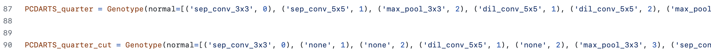

# PCDARTS on jetson nano

## Usage
### Search Phase
- Search the best cell on CIFAR10
- When finishing the search phase, you have to paste the model in `genotypes.py`
```
python3 train_search.py
```

### Evaluation Phase
```
python3 train.py --arch cell_structure

Add --set cifar100 if evaluate on CIFAR100.
```
- `cell_structure` can be replaced by any architectures in `genotypes.py`
- Example:<br />
  in genotypes.py
  <p align="center">
    
  </p>
&nbsp;
&nbsp;
&nbsp;
&nbsp;
`python3 train.py --arch PCDARTS_quarter` or `python3 train.py --arch PCDARTS_quarter_cut`


### Test
```
python3 test.py --arch cell_structure --model_path model_weight.pt --batch_size 1             #CIFAR10

python3 test_cifar100.py --arch cell_structure --model_path model_weight.pt --batch_size 1    #CIFAR100
```
- `cell_structure` can be replaced by any architectures in `genotypes.py`
- `model_path` is the path to your trained model
- `batch_size` can be change to increase throughput


## FLOPS Caculation
Package [THOP](https://github.com/Lyken17/pytorch-OpCounter) is required to caculate the FLOPS of the model
```
pip3 install thop
```
```
python3 flops.py --arch cell_structure --model_path model_path.pt
```
- `cell_structure` can be replaced by any architectures in `genotypes.py`
- `model_path` is the path to your trained model


## Visualization
Package [graphviz](https://graphviz.readthedocs.io/en/stable/index.html) is required to visualize the cells that you search
```
python3 visualize.py cell_structure
```
where `cell_structure` can be replaced by any architectures in `genotypes.py`


<br />

## Pretrained models
**CIFAR-10** 
- PCDARTS-1/4 ([cifar10_model.pt](https://drive.google.com/file/d/1IAJ43zyFcyUZcef3sAX6vyUhUX7_Xs0v/view?usp=sharing))
```
python3 test.py --arch PCDARTS_quarter --model_path cifar10_model.pt
```
- PCDARTS-1/4-cut ([cifar10_model_cut.pt](https://drive.google.com/file/d/1sX3-EOAONXEe3CeA5dE9qv-Ml41_-GMu/view?usp=sharing))
```
python3 test.py --arch PCDARTS_quarter_cut --model_path cifar10_model_cut.pt
```

<br />

**CIFAR-100** 
- PCDARTS-1/4 ([cifar100_model.pt](https://drive.google.com/file/d/1MFCK-VY_Knn3PqQ-0J8JbsISEaOQSIDU/view?usp=sharing))
```
python3 test_cifar100.py --arch PCDARTS_quarter --model_path cifar100_model.pt
```
- PCDARTS-1/4-cut ([cifar100_model_cut.pt](https://drive.google.com/file/d/1pxKi_mWnfY5nbQczWBhqdmzUbXiUBOd0/view?usp=sharing))
```
python3 test_cifar100.py --arch PCDARTS_quarter_cut --model_path cifar100_model_cut.pt
```


## Test on jetson nano

### Results on CIFAR10
Model | Accuracy(%) | Params(M) | FLOPS(M)
--- | :---: | :---: | :---: 
PCDARTS | 96.34 | 3.635 | 567.8
PCDARTS-1/4 | 95.40 | 0.989 | 162.1
PCDARTS-1/4-cut | 95.22 | 0.746 | 130.1

#### Batch size = 1
Model | Latency(s) | Throughput
--- | :---: | :---: 
PCDARTS | 22.6 | 3.76
PCDARTS-1/4 | 19.6 | 14.7
PCDARTS-1/4-cut | 17.8 | 18.9

#### Batch size = 20
Model | Latency(s) | Throughput
--- | :---: | :---: 
PCDARTS-1/4 | 30.16 | 176.3
PCDARTS-1/4-cut | 27.66 | 241.6

<br />

### Results on CIFAR100
Model | Accuracy(%) | Params(M) | FLOPS(M)
--- | :---: | :---: | :---: 
PCDARTS | 81.06 | 3.687 | 567.9
PCDARTS-1/4 | 77.73 | 1.041 | 162.1
PCDARTS-1/4-cut | 76.06 | 0.798 | 130.2

#### Batch size = 1
Model | Latency(s) | Throughput
--- | :---: | :---: 
PCDARTS | 23.4 | 3.85
PCDARTS-1/4 | 20.9 | 14.4
PCDARTS-1/4-cut | 18.5 | 18.1

#### Batch size = 20
Model | Latency(s) | Throughput
--- | :---: | :---: 
PCDARTS-1/4 | 34.0 | 161.1
PCDARTS-1/4-cut | 31.8 | 222.0


## Reference
H. Liu, K. Simonyan, and Y. Yang. DARTS: Differentiable architecture  search. ICLR, 2019

Xu, Y., Xie, L., Zhang, X., Chen, X., Qi, G.-J., Tian, Q., and Xiong, H. PC-DARTS: Partial channel connections for memory-efficient architecture search. In International Conference on Learning Representations, 2020 

Y. Mao, G. Zhong, Y. Wang and Z. Deng, "Differentiable Light-Weight Architecture Search," 2021 IEEE International Conference on Multimedia and Expo (ICME), 2021, pp. 1-6, doi: 10.1109/ICME51207.2021.9428132.

[PC-DARTS](https://github.com/yuhuixu1993/PC-DARTS)

[DARTS](https://github.com/quark0/darts)

[THOP: PyTorch-OpCounter](https://github.com/Lyken17/pytorch-OpCounter)
